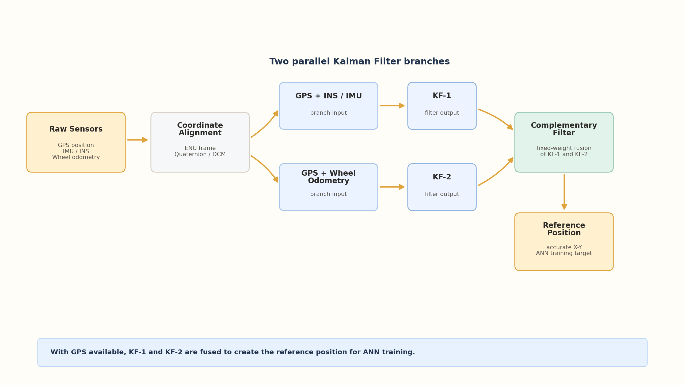
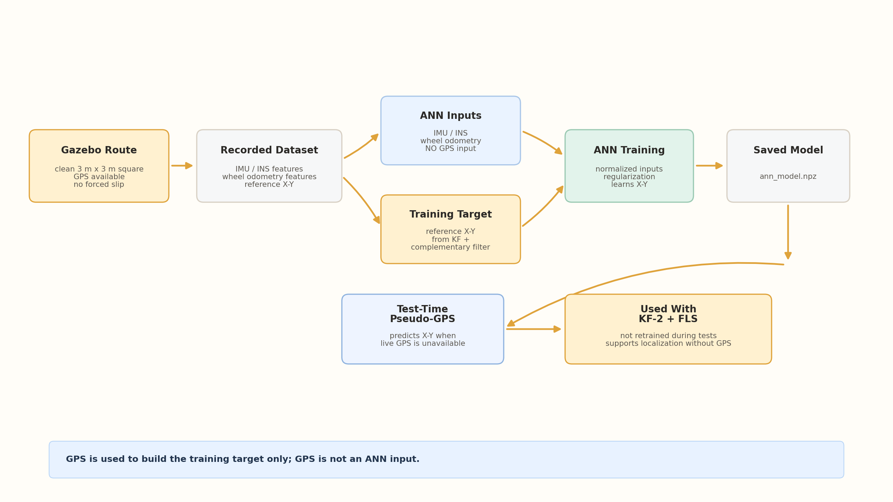
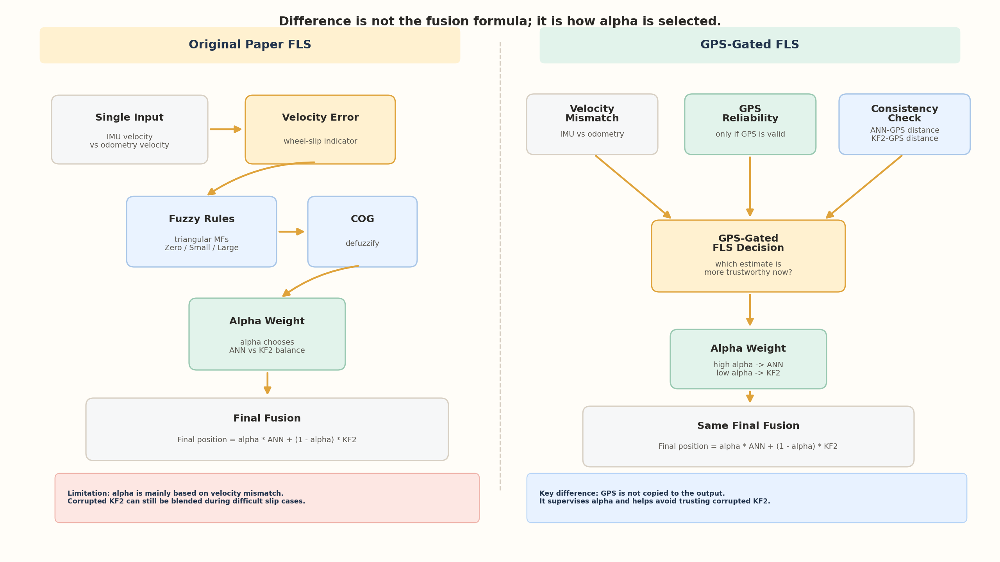
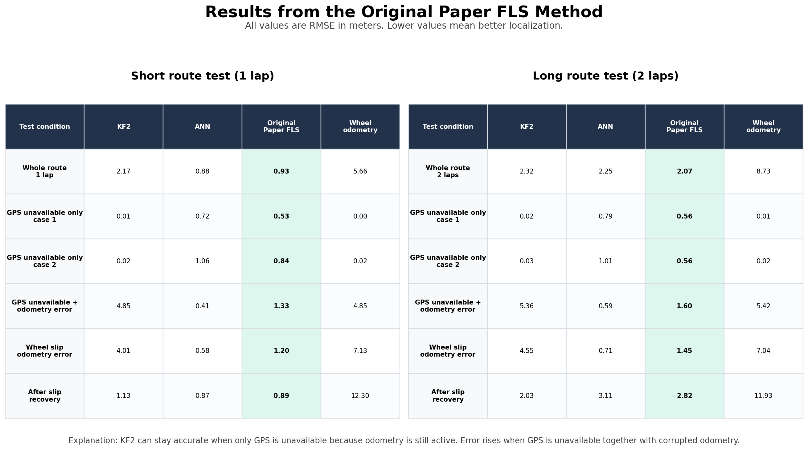
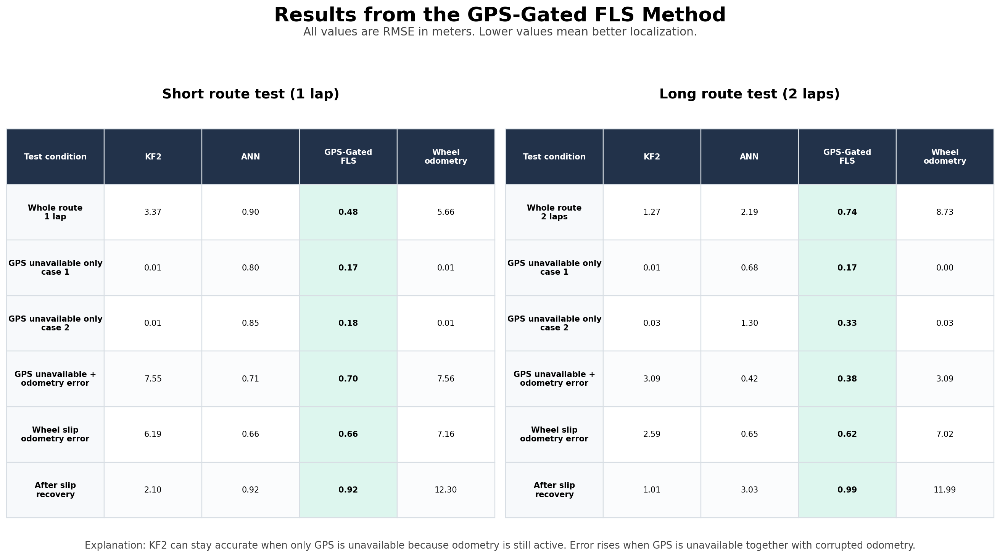
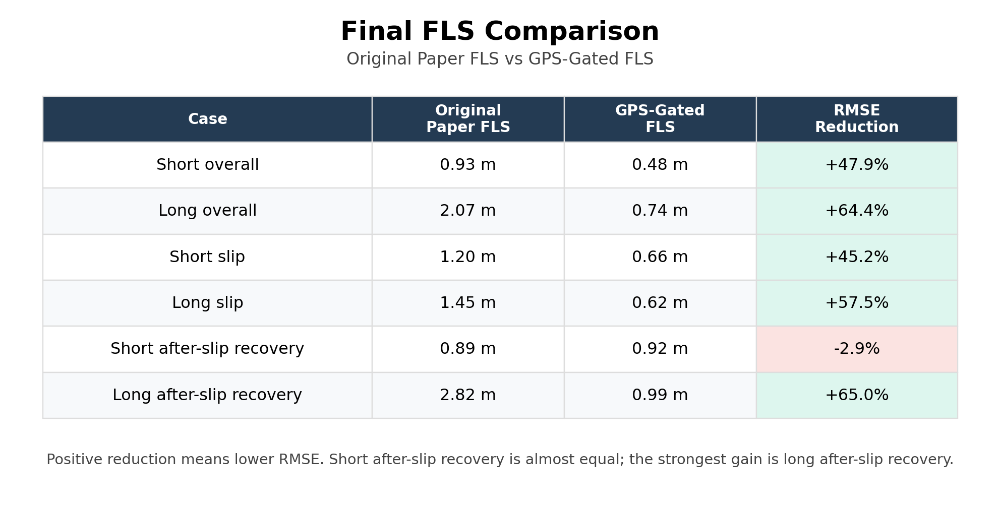

# GPS/INS/Odometry Localization with ANN and Fuzzy Logic Fusion

ROS 2 Humble and Gazebo project for mobile robot localization under GPS dropout
and wheel-slip conditions. The project reproduces the main sensor-fusion idea
from the paper *Information Fusion of GPS, INS and Odometer Sensors for
Improving Localization Accuracy of Mobile Robots in Indoor and Outdoor
Applications*, then adds a GPS-Gated FLS improvement for more robust alpha
selection during difficult slip cases.

The final system compares:

- **KF2**: GPS/held-GPS + wheel odometry Kalman filter.
- **ANN pseudo-GPS**: learned X-Y estimate from IMU and odometry features.
- **Original Paper FLS**: single-input fuzzy logic fusion using IMU-vs-odometry
  velocity mismatch.
- **GPS-Gated FLS**: modified fuzzy fusion that also checks GPS reliability and
  ANN/KF2 consistency before choosing the fusion weight.

## Project Objective

Estimate robot position more accurately when:

- live GPS is temporarily unavailable,
- wheel odometry is corrupted by slip,
- odometry may report motion even when the robot body is stopped or moving less
  than expected.

The goal is not to replace the paper method, but to reproduce it first and then
show a practical improvement for the most difficult cases.

## Methodology Overview

### Paper-Based Sensor Fusion

When GPS is available, the paper-based pipeline creates a reliable reference
position using two Kalman filter branches and a complementary filter.



The reference position is used as the ANN training target.

### ANN Training

The ANN model is trained from non-GPS features. GPS-aided fused position is used
only as the target during training; GPS is not an ANN input.



Active model:

```text
model: src/ann_model.npz
samples: 1545
target_mode: absolute
activation: logsig
input_frame: world
input_normalization: standard
```

### Original Paper FLS vs GPS-Gated FLS

Both FLS methods use the same final fusion formula:

```text
final_position = alpha * ANN + (1 - alpha) * KF2
```

The difference is how `alpha` is selected.



Original Paper FLS mainly asks:

```text
Is there velocity mismatch between IMU/INS and wheel odometry?
```

GPS-Gated FLS also asks:

```text
Is GPS reliable right now?
Which estimate is closer to reliable GPS: ANN or KF2?
Is odometry corrupted by slip?
```

GPS is not copied directly to the final output. It is used as a reliability
supervisor when it is available.

## Results

All values are RMSE in meters. Lower is better. Full numeric details are stored
in [`test_results/fls_compare_20260604/summary.md`](test_results/fls_compare_20260604/summary.md).

### Original Paper FLS



### GPS-Gated FLS



### Final Comparison



Key final comparison:

| Case | Original Paper FLS | GPS-Gated FLS | RMSE reduction |
|---|---:|---:|---:|
| Short overall | 0.93 m | 0.48 m | 47.9% |
| Long overall | 2.07 m | 0.74 m | 64.4% |
| Short slip | 1.20 m | 0.66 m | 45.2% |
| Long slip | 1.45 m | 0.62 m | 57.5% |
| Short after-slip recovery | 0.89 m | 0.92 m | -2.9% |
| Long after-slip recovery | 2.82 m | 0.99 m | 65.0% |

The strongest improvement appears in long-route and slip-related localization
cases, especially after wheel-slip recovery.

## Test Setup

Final comparison route:

```text
route profile: paper_mismatch_waypoint
GPS dropout windows: 18:8,34:14,54:12
wheel slip window: 38-56 s
wheel slip model: robot body stopped, wheel odometry scaled by 2.5x
short route: 1 lap
long route: 2 laps
```

GPS unavailable alone is not always the hardest case. KF2 can remain accurate if
odometry is still clean. The hard case is GPS unavailable together with
corrupted odometry.

## Repository Structure

```text
src/
  ann_model.npz
  ann_training_dataset.csv

  bumperbot_controller/
    launch/controller.launch.py
    launch/video_demo.launch.py
    bumperbot_controller/noisy_controller.py
    bumperbot_controller/scripted_trajectory.py

  bumperbot_description/
    launch/gazebo.launch.py
    urdf/bumperbot.urdf.xacro
    urdf/bumperbot_gazebo.xacro

  bumperbot_localization/
    launch/local_localization.launch.py
    config/ann_pseudo_gps.yaml
    config/ann_trainer.yaml
    config/fuzzy_localization.yaml
    config/gps_hold.yaml
    config/ekf_output_logger.yaml
    bumperbot_localization/ann_pseudo_gps.py
    bumperbot_localization/ann_trainer.py
    bumperbot_localization/fit_ann_model.py
    bumperbot_localization/fuzzy_localization.py
    bumperbot_localization/gps_hold.py
    bumperbot_localization/ekf_output_logger.py

presentation_assets/
  slide3_paper_sensor_fusion_figure.png
  slide4_ann_training_figure.png
  slide6_gps_gated_fls_method_figure.png
  original_paper_results_all_cases.png
  gps_gated_results_all_cases.png
  final_comparison_table.png
  video_script.md

test_results/fls_compare_20260604/summary.md
```

## Build

From the repository root:

```bash
colcon build --packages-select bumperbot_controller bumperbot_description bumperbot_localization
source install/setup.bash
```

## Training

Collect ANN training samples:

```bash
ros2 launch bumperbot_localization local_localization.launch.py \
  run_ann_pseudo:=false \
  run_ann_trainer:=true \
  run_ekf_logger:=false \
  ann_forced_dropout_windows:= \
  ann_force_gps_dropout_after_sec:=-1.0 \
  ann_force_gps_dropout_duration_sec:=0.0
```

Fit the ANN model offline:

```bash
ros2 run bumperbot_localization fit_ann_model.py \
  --dataset src/ann_training_dataset.csv \
  --model src/ann_model.npz \
  --iterations 3000 \
  --restarts 4 \
  --validation-fraction 0.20 \
  --validation-mode shuffle \
  --input-normalization standard \
  --target-mode absolute
```

## Final Comparison Test

Run localization:

```bash
ros2 launch bumperbot_localization local_localization.launch.py \
  run_ann_pseudo:=true \
  run_ann_trainer:=false \
  run_ekf_logger:=true \
  ann_forced_dropout_windows:=18:8,34:14,54:12 \
  ann_force_gps_dropout_after_sec:=-1.0 \
  ann_force_gps_dropout_duration_sec:=0.0
```

Run the scripted controller:

```bash
ros2 launch bumperbot_controller controller.launch.py \
  run_scripted_trajectory:=true \
  scripted_trajectory_profile:=paper_mismatch_waypoint \
  scripted_speed_scale:=1.0 \
  scripted_laps:=2 \
  paper_slip_mode:=true \
  scripted_physical_slip_start_sec:=38.0 \
  scripted_physical_slip_duration_sec:=18.0 \
  scripted_physical_slip_linear_scale:=0.0 \
  scripted_physical_slip_angular_scale:=0.0 \
  slip_start_sec:=38.0 \
  slip_duration_sec:=18.0 \
  slip_linear_scale:=2.5 \
  slip_angular_scale:=2.5
```

Set `scripted_laps:=1` for the short route.

## Video Demo

For recording the project video, one launch file starts Gazebo GUI,
localization, logging, and the scripted dropout/slip route:

```bash
ros2 launch bumperbot_controller video_demo.launch.py scripted_laps:=1
```

Use `scripted_laps:=2` for the longer route. Gazebo now opens with the GUI by
default; pass `headless:=true` only for server-only runs.

## Interpretation

The Original Paper FLS reproduces the paper's single-input fuzzy fusion idea.
However, in wheel-slip cases it may still blend corrupted KF2/odometry data.

The GPS-Gated FLS keeps the same ANN/KF2 fusion formula but improves the alpha
decision. It is most useful when odometry becomes unreliable, especially in
long-route slip and after-slip recovery windows.

## Notes

Generated raw ROS logs are intentionally ignored by git:

```text
src/ann_pseudo_gps_log*.csv
src/ekf_output_log.csv
src/fuzzy_localization_log.csv
src/gps_hold_log.csv
test_results/**/*.csv
```

Only summarized results and selected presentation figures are kept in the
repository.
