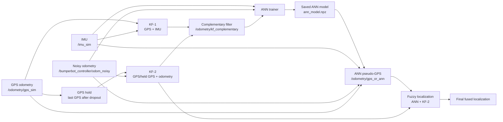

# EKF-ANN-FLS Localization for a Mobile Robot

This repository contains a ROS 2 and Gazebo based localization framework for a differential-drive mobile robot. The project investigates how GPS, IMU, wheel odometry, Kalman filtering, an Artificial Neural Network (ANN), and a Fuzzy Logic System (FLS) can be combined to improve localization when GPS becomes unavailable and wheel odometry becomes unreliable because of slip.

The implementation is based on the localization methodology proposed in the GPS/INS/odometer information-fusion literature. The main idea is simple:

1. While GPS is available, use GPS-aided Kalman filters to produce a reliable reference position.
2. Train an ANN using only IMU and odometry based inputs, with the GPS-aided fused position as the target.
3. When GPS is lost, use the trained ANN as a pseudo-GPS sensor.
4. When wheel slip occurs, use an FLS to decide how much to trust the ANN and how much to trust the odometry-based Kalman filter.

The final system does not assume that the ANN is always better than odometry. Instead, it uses each estimator where it is strongest:

- In normal no-slip motion, odometry and KF-2 are usually more accurate.
- During slip, odometry becomes biased and KF-2 drifts.
- In slip conditions, the ANN becomes useful because it is not only following raw wheel displacement.
- The FLS dynamically blends ANN and KF-2 according to the detected motion inconsistency.

## Table of Contents

- [Project Motivation](#project-motivation)
- [Methodology](#methodology)
- [ROS 2 System Architecture](#ros-2-system-architecture)
- [Main Packages and Files](#main-packages-and-files)
- [ANN Training Pipeline](#ann-training-pipeline)
- [GPS Dropout and Pseudo-GPS Pipeline](#gps-dropout-and-pseudo-gps-pipeline)
- [Fuzzy Logic Fusion](#fuzzy-logic-fusion)
- [Build Instructions](#build-instructions)
- [Training Instructions](#training-instructions)
- [Testing Instructions](#testing-instructions)
- [Generated Logs](#generated-logs)
- [Experimental Results](#experimental-results)
- [Interpretation of Results](#interpretation-of-results)
- [Final Artifact Organization](#final-artifact-organization)

## Project Motivation

Outdoor mobile robots often rely on GPS for global position correction. However, GPS is not always available. A robot may enter an indoor area, pass through a GPS-denied region, or experience temporary signal degradation. In those cases, localization must continue using proprioceptive sensors such as the IMU and wheel odometry.

Wheel odometry alone is not enough because its error accumulates over time. The problem becomes more severe when the wheels slip. During slip, the wheel encoders can report motion that does not match the actual robot displacement. As a result, an odometry-based filter may drift quickly.

This project studies a hybrid solution:

- Kalman filters provide reliable localization while GPS is available.
- An ANN learns the nonlinear relation between IMU/odometry signals and the GPS-aided reference position.
- During GPS outage, the ANN provides a pseudo-GPS estimate.
- An FLS monitors motion inconsistency and blends ANN with the odometry-based Kalman filter.

## Methodology

The system follows the main structure of the reference paper.

### 1. GPS-Aided Localization While GPS Is Available

When GPS is available, two Kalman-filter-based localization streams run in parallel:

- **KF-1: GPS + IMU**
  - Uses GPS and IMU information.
  - Represents the GPS/INS side of the methodology.

- **KF-2: GPS + odometry**
  - Uses GPS or held GPS and wheel odometry.
  - Represents the GPS/odometer side of the methodology.

The outputs of these filters are combined by a complementary filter:

```text
x_kfc, y_kfc = complementary(KF-1, KF-2)
```

This complementary output is used as the ANN target during training.

### 2. ANN Training

The ANN is trained while GPS is available. GPS is not used as an ANN input. This is important because the ANN must be able to operate when GPS is lost.

The ANN input vector is built from IMU and odometry information. The target is the GPS-aided complementary filter output:

```text
ANN input  = IMU + odometry features
ANN target = complementary GPS-aided position
```

The final model used in the experiments has the following properties:

```text
Architecture: 15 input neurons, 10 hidden neurons, 5 hidden neurons, 2 output neurons
Activation: log-sigmoid hidden layers, linear output layer
Target mode: absolute position
Input normalization: standard normalization
Saved model: ann_model.npz
```

### 3. GPS Dropout

During forced or natural GPS dropout:

- GPS is no longer trusted.
- The ANN pseudo-GPS node switches from GPS output to ANN output.
- The saved ANN model estimates position from IMU and odometry features.
- The output is published as `/odometry/gps_or_ann`.

### 4. Fuzzy Logic Fusion During Slip

The FLS combines ANN and KF-2:

```text
final_position = alpha_ann * ANN_position + alpha_kf2 * KF2_position
```

The FLS uses the velocity inconsistency between IMU-derived motion and odometry motion as the slip indicator.

Expected behavior:

- If there is no slip, odometry is reliable, so `alpha_kf2` should be high.
- If slip increases, odometry becomes unreliable, so `alpha_ann` should increase.

## ROS 2 System Architecture



## Main Packages and Files

```text
src/
  bumperbot_controller/
    launch/
      controller.launch.py
    bumperbot_controller/
      noisy_controller.py

  bumperbot_description/
    urdf/
    worlds/

  bumperbot_localization/
    launch/
      local_localization.launch.py
    config/
      ann_trainer.yaml
      ann_pseudo_gps.yaml
      fuzzy_localization.yaml
      gps_hold.yaml
      ekf_gps_imu.yaml
      ekf_gps_odom.yaml
      complementary_filter.yaml
      ekf_output_logger.yaml
    bumperbot_localization/
      ann_trainer.py
      fit_ann_model.py
      ann_pseudo_gps.py
      fuzzy_localization.py
      gps_hold.py
      ekf_output_logger.py
```

### Important Nodes

| Node | File | Purpose |
|---|---|---|
| ANN trainer | `ann_trainer.py` | Collects training samples and optionally fine-tunes an existing model |
| Offline ANN fitter | `fit_ann_model.py` | Trains an ANN model from a saved CSV dataset |
| ANN pseudo-GPS | `ann_pseudo_gps.py` | Publishes GPS while available and ANN pseudo-GPS after dropout |
| GPS hold | `gps_hold.py` | Holds the last GPS position after dropout for KF-2 |
| Fuzzy localization | `fuzzy_localization.py` | Blends ANN and KF-2 using fuzzy weights |
| EKF output logger | `ekf_output_logger.py` | Logs KF2, ANN, odometry, GPS, and final outputs |
| Noisy controller | `noisy_controller.py` | Publishes noisy odometry and can simulate wheel slip |

## ANN Training Pipeline

The training pipeline has two modes:

1. Online sample collection with `ann_trainer.py`.
2. Offline model fitting with `fit_ann_model.py`.

### Online Dataset Collection

The trainer collects samples only while GPS is available. If forced dropout starts, the trainer stops collecting samples. This prevents the model from learning from GPS-denied data where the target is no longer GPS-corrected.

The dataset is saved to:

```text
~/bumperbot_ws/src/ann_training_dataset.csv
```

The active model is saved to:

```text
~/bumperbot_ws/src/ann_model.npz
```

### Offline ANN Fitting

The offline fitter trains the model from the CSV dataset. The final successful configuration used:

```text
target_mode: absolute
input_normalization: standard
validation_mode: shuffle
```

The final model metadata observed during tests:

```text
samples: 1183
target_mode: absolute
input_normalization: standard
sha256 prefix: 31c1594f7caa
```

## GPS Dropout and Pseudo-GPS Pipeline

The ANN pseudo-GPS node publishes GPS when it is available. After timeout or forced dropout, it switches to the saved ANN model.

Important behavior:

- Output topic: `/odometry/gps_or_ann`
- Debug topic: `/odometry/ann`
- Log file: `~/bumperbot_ws/src/ann_pseudo_gps_log.csv`
- Existing logs are protected by backup files named `ann_pseudo_gps_log.previous_<run_id>.csv`.
- Each log row stores the model hash and run ID to detect accidental model or node changes.

## Fuzzy Logic Fusion

The FLS is used because ANN and KF-2 are not equally reliable under all conditions.

### No-Slip Case

When there is no wheel slip, odometry remains reliable. In this case, KF-2 is usually better than the ANN because it uses direct wheel motion and the last GPS reference.

Expected FLS behavior:

```text
low velocity inconsistency -> high KF2 weight -> low ANN weight
```

### Slip Case

When slip occurs, the odometry reports motion that does not fully match the actual robot displacement. KF-2 begins to drift. In this case, the ANN becomes more useful.

Expected FLS behavior:

```text
high velocity inconsistency -> high ANN weight -> low KF2 weight
```

This is consistent with the reference paper: FLS does not simply replace KF-2 with ANN. It dynamically blends them.

## Build Instructions

```bash
cd ~/bumperbot_ws
colcon build --packages-select bumperbot_controller bumperbot_description bumperbot_localization
source install/setup.bash
```

If Python executables are not marked as executable:

```bash
chmod +x ~/bumperbot_ws/src/bumperbot_localization/bumperbot_localization/ann_trainer.py
chmod +x ~/bumperbot_ws/src/bumperbot_localization/bumperbot_localization/ann_pseudo_gps.py
chmod +x ~/bumperbot_ws/src/bumperbot_localization/bumperbot_localization/fit_ann_model.py
chmod +x ~/bumperbot_ws/src/bumperbot_controller/bumperbot_controller/noisy_controller.py
```

## Training Instructions

Start localization with ANN training enabled:

```bash
ros2 launch bumperbot_localization local_localization.launch.py \
  run_ann_pseudo:=false \
  run_ann_trainer:=true \
  run_ekf_logger:=false \
  ann_force_gps_dropout_after_sec:=-1.0
```

Start the controller:

```bash
ros2 launch bumperbot_controller controller.launch.py
```

Recommended training route:

- Drive while GPS is available.
- Include repeated 3x3 square laps.
- Include forward and reverse direction if needed.
- Include straight segments, turns, and different speeds.
- Avoid training after forced GPS dropout.

Fit the model offline:

```bash
ros2 run bumperbot_localization fit_ann_model.py \
  --dataset ~/bumperbot_ws/src/ann_training_dataset.csv \
  --model ~/bumperbot_ws/src/ann_model.npz \
  --iterations 3000 \
  --restarts 4 \
  --validation-fraction 0.20 \
  --validation-mode shuffle \
  --input-normalization standard \
  --target-mode absolute
```

## Testing Instructions

Before each clean test, remove active logs:

```bash
rm -f ~/bumperbot_ws/src/ann_pseudo_gps_log*.csv \
      ~/bumperbot_ws/src/ekf_output_log.csv \
      ~/bumperbot_ws/src/fuzzy_localization_log.csv \
      ~/bumperbot_ws/src/gps_hold_log.csv
```

### No-Slip GPS Dropout Test

Run localization:

```bash
ros2 launch bumperbot_localization local_localization.launch.py \
  run_ann_pseudo:=true \
  run_ann_trainer:=false \
  run_ekf_logger:=true \
  ann_force_gps_dropout_after_sec:=45.0 \
  ann_force_gps_dropout_duration_sec:=0.0
```

Run the controller without slip:

```bash
ros2 launch bumperbot_controller controller.launch.py
```

Drive the robot from the beginning of the test. Do not wait until GPS dropout to start moving. Continue driving after GPS dropout.

### Slip Test

Run localization:

```bash
ros2 launch bumperbot_localization local_localization.launch.py \
  run_ann_pseudo:=true \
  run_ann_trainer:=false \
  run_ekf_logger:=true \
  ann_force_gps_dropout_after_sec:=45.0 \
  ann_force_gps_dropout_duration_sec:=0.0
```

Run the controller with simulated slip:

```bash
ros2 launch bumperbot_controller controller.launch.py \
  slip_start_sec:=55.0 \
  slip_duration_sec:=60.0 \
  slip_linear_scale:=1.35 \
  slip_angular_scale:=1.20
```

Recommended test procedure:

1. Start driving immediately.
2. Drive normally while GPS is available.
3. GPS dropout starts at approximately 45 seconds.
4. Slip starts at approximately 55 seconds.
5. Continue driving for about two laps after slip starts.
6. Stop both terminals with `Ctrl+C`.

## Generated Logs

The main logs are:

```text
~/bumperbot_ws/src/ann_pseudo_gps_log.csv
~/bumperbot_ws/src/ekf_output_log.csv
~/bumperbot_ws/src/fuzzy_localization_log.csv
~/bumperbot_ws/src/gps_hold_log.csv
~/bumperbot_ws/src/ann_training_dataset.csv
```

Useful checks:

```bash
ros2 node list | grep -E "ann_pseudo|ann_trainer|ekf_output|fuzzy|gps_hold"

ls -lh ~/bumperbot_ws/src/ann_pseudo_gps_log*.csv \
       ~/bumperbot_ws/src/ekf_output_log.csv \
       ~/bumperbot_ws/src/fuzzy_localization_log.csv \
       ~/bumperbot_ws/src/gps_hold_log.csv

tail -n 5 ~/bumperbot_ws/src/ann_pseudo_gps_log.csv
```

## Experimental Results

The following results are from the final clean evaluation runs.

### No-Slip GPS Dropout

In the no-slip test, odometry is reliable. Therefore, KF-2 is expected to be more accurate than ANN. The FLS should give most of the weight to KF-2.

| Test window | KF2 / Odom RMSE | ANN RMSE | FLS RMSE | Result |
|---|---:|---:|---:|---|
| GPS dropout, no slip | 0.148 m | 0.453 m | 0.179 m | KF2 is best; FLS stays close to KF2 |

Average FLS weights:

| alpha_ann | alpha_kf2 |
|---:|---:|
| 0.012 | 0.988 |

This is the desired behavior. In no-slip motion, ANN is not expected to outperform KF-2.

### Slip During GPS Dropout

In the slip test, odometry becomes unreliable. KF-2 accumulates error, and the ANN becomes more useful.

| Test window | KF2 / Odom RMSE | ANN RMSE | FLS RMSE | ANN improvement over KF2 |
|---|---:|---:|---:|---:|
| GPS dropout period | 1.897 m | 1.405 m | 1.308 m | 26.0% |
| Slip period | 2.225 m | 1.554 m | 1.532 m | 30.2% |
| Early slip | 1.237 m | 1.262 m | 1.107 m | -2.0% |
| Longer slip | 2.650 m | 1.707 m | 1.740 m | 35.6% |

Observed behavior:

- In no-slip motion, KF-2 remains the most accurate estimator.
- In slip motion, ANN outperforms KF-2.
- As slip accumulates, the ANN advantage becomes stronger.
- FLS improves the combined result in the full dropout and full slip windows.
- In longer slip, ANN alone was slightly better than FLS, which indicates that FLS weights can still be tuned further.

## Interpretation of Results

The results match the intended methodology.

ANN is not a universal replacement for KF-2. It is a learned pseudo-sensor that becomes useful when odometry becomes unreliable. Therefore, the no-slip result should not be interpreted as ANN failure. In no-slip motion, KF-2 is expected to be better because odometry is still physically meaningful.

The important result is the slip case:

```text
KF2 RMSE during slip: 2.225 m
ANN RMSE during slip: 1.554 m
Improvement: 30.2%
```

This shows that the ANN reduces localization error when wheel slip causes odometry-based drift.

The FLS behavior is also consistent with the paper:

- It gives high KF-2 weight in no-slip motion.
- It increases ANN weight when slip is detected.
- It can outperform both individual estimates when the ANN and KF-2 errors compensate each other.

## Final Artifact Organization

During experiments, many candidate models and logs can be generated. The recommended final organization is:

```text
final_results/
  final_model/
    ann_model_final_1183_absolute_standard_31c1594f.npz
    ann_training_dataset_final.csv

  no_slip_test/
    ann_pseudo_gps_log.csv
    ekf_output_log.csv
    fuzzy_localization_log.csv
    gps_hold_log.csv

  slip_test/
    ann_pseudo_gps_log.csv
    ekf_output_log.csv
    fuzzy_localization_log.csv
    gps_hold_log.csv

  archive_models/
    previous_candidate_models.npz
```

The active model used by the launch files should remain at:

```text
~/bumperbot_ws/src/ann_model.npz
```

## Limitations and Future Work

Current limitations:

- FLS weights can be tuned further, especially for long slip windows.
- The ANN model was trained and evaluated in simulation, so real-world transfer would require additional calibration.
- The final results depend on route similarity, sensor noise profile, and slip intensity.

Possible future improvements:

- Tune FLS membership thresholds with multiple slip severities.
- Add automated evaluation scripts for RMSE tables and plots.
- Add trajectory plots comparing KF2, ANN, FLS, and reference paths.
- Test additional routes beyond the 3x3 square trajectory.
- Validate the method on a physical robot.

