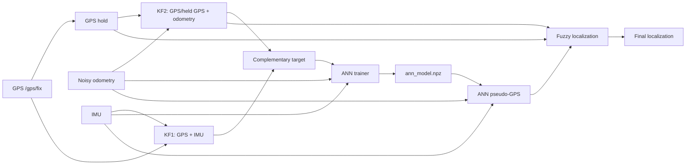

# EKF-and-ANN: GPS/INS/Odometry Localization with ANN and Fuzzy Fusion

This repository contains a ROS 2 Humble and Gazebo localization project for a
differential-drive mobile robot. The work reproduces the main ANN + Kalman
filter + fuzzy logic localization idea from the reference paper, then extends it
with a GPS-gated fuzzy fusion strategy for wheel-slip and GPS-dropout cases.

## Goal

The localization problem is tested under two difficult conditions:

- GPS dropout: the robot temporarily loses live GPS correction.
- Wheel slip: the wheel odometry reports motion while the simulated robot body
  is stopped or moving less than expected.

The system compares four estimates:

- **KF2**: GPS/held-GPS + wheel odometry Kalman filter.
- **ANN**: learned pseudo-GPS estimate from IMU and odometry features.
- **Paper-style FLS**: single-input fuzzy logic system using the odometry/IMU
  velocity mismatch.
- **Proposed GPS-gated FLS**: fuzzy fusion extended with GPS reliability,
  ANN-vs-GPS consistency, KF2-vs-GPS consistency, and slip-state gating.

## Method Summary

### Paper-Style Reproduction

The reproduced fuzzy logic system follows the paper structure:

```text
input:  |v_odom - v_imu|
output: alpha_ann

final_position = alpha_ann * ANN + (1 - alpha_ann) * KF2
```

For paper-comparison runs, the implementation uses:

- raw odometry/IMU velocity error,
- triangular membership functions,
- Mamdani-style center-of-gravity defuzzification,
- no GPS gate,
- no slip latch,
- no severe-slip boost,
- no adaptive velocity correction.

### Proposed GPS-Gated FLS

The proposed method keeps the fuzzy ANN/KF2 fusion, but adds a supervisory gate:

```text
1. Compute fuzzy alpha from odometry/IMU velocity mismatch.
2. Check GPS-hold covariance to decide whether GPS is reliable.
3. If GPS is reliable, compare ANN and KF2 distance to GPS.
4. If GPS is unreliable and slip is active, allow ANN to dominate.
5. Publish the fused ANN/KF2 position.
```

This does **not** replace the final output with raw GPS. GPS is used as a
reliability reference when it is available. During GPS dropout, the ANN remains
important because it acts as the pseudo-GPS source when odometry/KF2 can drift.

## ROS 2 Architecture



## Main Files

```text
src/
  ann_model.npz
  ann_training_dataset.csv

  bumperbot_controller/
    launch/controller.launch.py
    bumperbot_controller/noisy_controller.py
    bumperbot_controller/scripted_trajectory.py

  bumperbot_localization/
    launch/local_localization.launch.py
    config/ann_pseudo_gps.yaml
    config/ann_trainer.yaml
    config/fuzzy_localization.yaml
    config/gps_hold.yaml
    config/ekf_output_logger.yaml
    bumperbot_localization/ann_pseudo_gps.py
    bumperbot_localization/ann_trainer.py
    bumperbot_localization/fit_ann_model.py
    bumperbot_localization/fuzzy_localization.py
    bumperbot_localization/gps_hold.py
    bumperbot_localization/ekf_output_logger.py

test_results/fls_compare_20260604/summary.md
```

## Current ANN Model

The active ANN model is stored at:

```text
src/ann_model.npz
```

Observed metadata from the final runs:

```text
samples: 1545
target_mode: absolute
activation: logsig
input_frame: world
input_normalization: standard
sha256 prefix: 7e8705aca4b2
```

## Build

From the repository root:

```bash
colcon build --packages-select bumperbot_controller bumperbot_description bumperbot_localization
source install/setup.bash
```

## Training

Collect ANN training samples:

```bash
ros2 launch bumperbot_localization local_localization.launch.py \
  run_ann_pseudo:=false \
  run_ann_trainer:=true \
  run_ekf_logger:=false \
  ann_forced_dropout_windows:= \
  ann_force_gps_dropout_after_sec:=-1.0 \
  ann_force_gps_dropout_duration_sec:=0.0
```

Fit the ANN model offline:

```bash
ros2 run bumperbot_localization fit_ann_model.py \
  --dataset src/ann_training_dataset.csv \
  --model src/ann_model.npz \
  --iterations 3000 \
  --restarts 4 \
  --validation-fraction 0.20 \
  --validation-mode shuffle \
  --input-normalization standard \
  --target-mode absolute
```

## Final Comparison Test

The final comparison uses the scripted route:

```text
profile: paper_mismatch_waypoint
GPS dropout windows: 18:8,34:14,54:12
wheel slip: physical body stopped, wheel odometry scaled by 2.5x
short route: 1 lap
long route: 2 laps
```

Run localization:

```bash
ros2 launch bumperbot_localization local_localization.launch.py \
  run_ann_pseudo:=true \
  run_ann_trainer:=false \
  run_ekf_logger:=true \
  ann_forced_dropout_windows:=18:8,34:14,54:12 \
  ann_force_gps_dropout_after_sec:=-1.0 \
  ann_force_gps_dropout_duration_sec:=0.0
```

Run the scripted controller:

```bash
ros2 launch bumperbot_controller controller.launch.py \
  run_scripted_trajectory:=true \
  scripted_trajectory_profile:=paper_mismatch_waypoint \
  scripted_speed_scale:=1.0 \
  scripted_laps:=2 \
  paper_slip_mode:=true \
  scripted_physical_slip_start_sec:=38.0 \
  scripted_physical_slip_duration_sec:=18.0 \
  scripted_physical_slip_linear_scale:=0.0 \
  scripted_physical_slip_angular_scale:=0.0 \
  slip_start_sec:=38.0 \
  slip_duration_sec:=18.0 \
  slip_linear_scale:=2.5 \
  slip_angular_scale:=2.5
```

Set `scripted_laps:=1` for the short route.

## Results

All values are RMSE in meters. The complete table is stored in
[`test_results/fls_compare_20260604/summary.md`](test_results/fls_compare_20260604/summary.md).

| Test | KF2 | ANN | FLS | Odom |
|---|---:|---:|---:|---:|
| Paper-COG short overall | 2.1676 | 0.8849 | 0.9282 | 5.6566 |
| Paper-COG long overall | 2.3172 | 2.2475 | 2.0707 | 8.7293 |
| GPS-gated short overall | 3.3663 | 0.8989 | 0.4838 | 5.6639 |
| GPS-gated long overall | 1.2691 | 2.1877 | 0.7373 | 8.7344 |

Slip-window RMSE:

| Test | KF2 | ANN | FLS | Odom |
|---|---:|---:|---:|---:|
| Paper-COG short slip | 4.0132 | 0.5751 | 1.2006 | 7.1292 |
| Paper-COG long slip | 4.5517 | 0.7059 | 1.4535 | 7.0350 |
| GPS-gated short slip | 6.1936 | 0.6628 | 0.6580 | 7.1590 |
| GPS-gated long slip | 2.5921 | 0.6491 | 0.6182 | 7.0235 |

## Interpretation

The paper-style FLS successfully reproduces the single-input fuzzy fusion idea,
but in the tested wheel-spin case it can still blend in corrupted KF2/odometry
information during slip. This makes it weaker than ANN in some slip windows.

The proposed GPS-gated FLS is more robust in the final tests:

- It keeps ANN useful during GPS dropout and slip.
- It prevents unnecessary ANN dominance when reliable GPS/KF2 is closer to the
  reference.
- It gives the lowest overall RMSE in both short and long routes.

Long-route overall result:

```text
Paper-COG FLS: 2.0707 m
GPS-gated FLS: 0.7373 m
```

This means the project both reproduces the paper-style method and adds a
measurable innovation for GPS-dropout plus wheel-slip localization.

## Generated Files

Runtime logs are intentionally ignored by Git:

```text
src/ann_pseudo_gps_log*.csv
src/ekf_output_log.csv
src/fuzzy_localization_log.csv
src/gps_hold_log.csv
test_results/**/*.csv
```

Only the final summarized comparison is kept in the repository.

